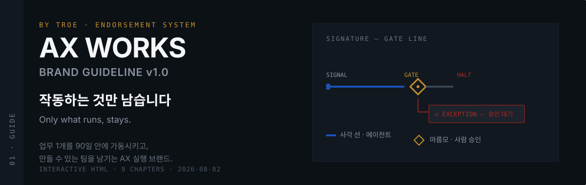
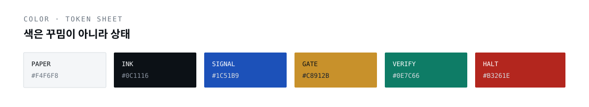
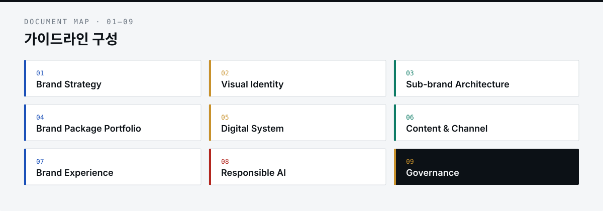

# AX WORKS Brand Guideline

<p align="center">
  
</p>

**AX WORKS by TROE**의 공식 브랜드 가이드라인 v1.0입니다.  
마케팅·PR 팀이 AI를 도입할 때, 업무 1개를 **90일 안에 가동**시키고 **만들 수 있는 팀**을 남기는 AX 실행 브랜드의 말·시각·운영 규칙을 한 문서에 모았습니다.

> 도구를 파는 벤더도, 보고서를 파는 컨설팅도 아닙니다.  
> **결과물이 아니라 만들 수 있는 사람을 남긴다**는 점이 다릅니다.

---

## 바로 열기

브라우저에서 단일 HTML을 열면 전체 가이드라인을 바로 볼 수 있습니다.

```bash
open "AX WORKS Brand Guideline.html"
```

| 파일 | 역할 |
| --- | --- |
| [`AX WORKS Brand Guideline.html`](./AX%20WORKS%20Brand%20Guideline.html) | 단일 파일 내보내기 — **열람용** |
| [`AX WORKS Brand Guideline.dc.html`](./AX%20WORKS%20Brand%20Guideline.dc.html) | dc 소스 템플릿 |
| [`support.js`](./support.js) | dc-runtime 지원 스크립트 |

---

## 시그니처 — Gate Line

가로선은 에이전트가 처리하는 구간, **마름모는 사람이 직접 판단하는 승인 지점**입니다.  
예외가 생기면 라인은 마름모에서 멈춥니다. “사람 승인 없는 자동화는 우리 방식이 아니다”를 그림 하나로 말합니다.

<p align="center">
  
</p>

| 항목 | 규칙 |
| --- | --- |
| 정식 표기 | **AX WORKS** (전부 대문자 · 공백 1) · 국문 병기 시 AX 웍스 |
| 표기 금지 | AXWorks · Ax Works · AX-WORKS · 액스웍스 |
| 엔도스먼트 | AX WORKS **by TROE** |
| 코어 아이디어 | 작동하는 것만 남는다 · 지표는 **가동률** |
| 디자인 컨셉 | 운영 콘솔과 명세서 — 글로우·그라디언트·추상 3D 금지 |
| 타이포 | Display KR Pretendard 800 · EN IBM Plex Sans · Utility IBM Plex Mono |

---

## 가이드라인 구성

<p align="center">
  
</p>

| # | 장 | 요약 |
| --- | --- | --- |
| 01 | **Brand Strategy** | 왜 TROE와 이름을 나누는지, 네이밍·포지셔닝·보이스·Evidence Library |
| 02 | **Visual Identity** | Gate Line, 로고 락업, 컬러 토큰, 타이포, 도형 문법, 모션 |
| 03 | **Sub-brand Architecture** | AX WORKS + 동사/산출물 네이밍 · GAEO 예외 |
| 04 | **Brand Package Portfolio** | 다이어그램 키트, PPTX 14종, 소셜·명함·워크숍 키트 |
| 05 | **Digital System** | 4px 스페이싱, UI 키트, 아이콘, 차트, Diagnose/Blueprint/Operate |
| 06 | **Content & Channel** | 영문 사이트 · LinkedIn · Instagram · 블로그 규격 |
| 07 | **Brand Experience** | 고객 여정 터치포인트와 행동 원칙 |
| 08 | **Responsible AI** | 리스크 커뮤니케이션 · 사고 시 문구 · 금지 약속형 표현 |
| 09 | **Governance** | 로고 오용, 파일명, 접근성, 승인, 공동 브랜딩, KPI |

---

## 핵심 규칙 (요약)

1. **색은 꾸밈이 아니라 상태** — Paper / Ink / Signal / Gate / Verify / Halt를 제품·슬라이드·광고에 동일 적용
2. **모션은 기본 OFF** — 예외는 Gate Line 커버 애니메이션뿐 (`prefers-reduced-motion` 존중)
3. **스톡 이미지 금지** — 악수·회의실·홀로그램 뇌 대신 타이포와 Gate Line 키트
4. **대외 수치는 Evidence Library에 있는 것만** 사용
5. **채널 카피** — 수치로 시작 → 예외를 보여줌 → CTA는 하나

도형 문법: **사각 = 에이전트** · **마름모 = 사람** · **원 = 데이터**

---

## 근거 · 문의

- 작성일: 2026-08-01 · 가이드라인: 2026-08-02  
- 근거 문서: TROE 신규 서비스 상품 PRD v1.1  
- 이메일: [ax@allrounder.im](mailto:ax@allrounder.im)  
- 사이트: [axworks.im](https://axworks.im)

---

*AX WORKS Brand Guideline v1.0 · AX WORKS by TROE*
